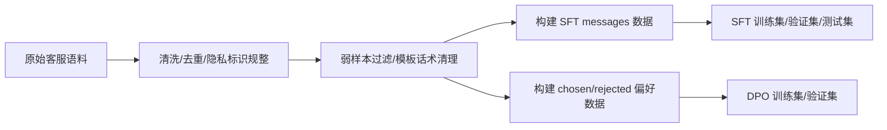

# 电商客服问答大模型后训练：SFT + DPO + LoRA 消融

本项目面向退换货、物流、商品咨询、价格优惠、赠品规则等高频电商客服场景，基于 **Qwen3-8B-Base** 搭建了一套从数据治理、SFT 指令微调、DPO 偏好对齐、批量评测到消融实验的完整后训练流水线。

- 基座模型回答冗长、答非所问、容易生成模板废话。
- 多轮客服对话中历史信息噪声大，模型容易跟随错误上下文漂移。
- ChatML 边界、结束符、训练和推理 system prompt 不一致时，模型容易停不下来。
- 纯 SFT 可以显著压缩回复长度，但仍会出现“短答但业务规则错误”的问题。
- DPO 可以进一步把模型偏向更简短、更符合客服偏好的答案。

> 说明：本仓库默认不提交原始隐私数据、大模型权重和训练 checkpoint。`.gitignore` 已排除 `data/raw/`、`data/processed/` 和 `outputs/`。

## 项目结构

```text
.
├── configs/
│   └── deepspeed_zero2.json              # DeepSpeed ZeRO-2 配置
├── data/
│   ├── cleaned/                          # 清洗后的中间数据
│   ├── processed_5000/                   # SFT / DPO 训练数据
│   └── raw/                              # 原始数据，默认不建议开源
├── runs/
│   ├── sft/run_sft_qwen3_8b_qlora.sh     # 正式 SFT 训练入口
│   ├── dpo/run_dpo_qwen3_8b_qlora.sh     # 正式 DPO 训练入口
│   ├── infer/run_compare_batch_infer_qwen3_8b.sh
│   └── ablation/
│       ├── run_lora_ablation_sft.sh      # LoRA / QLoRA 消融
│       └── run_dpo_ablation.sh           # DPO beta / 噪声消融
├── scripts/
│   ├── data_clean/                       # 数据清洗与格式转换
│   ├── sft/                              # SFT 训练、推理、评测、loss 绘图
│   ├── dpo/                              # DPOTrainer 训练脚本
│   └── ablation/                         # 消融结果汇总与偏好评测
├── requirements.txt
└── README.md
```

## 环境准备

推荐环境：

- Linux / WSL2
- Python 3.10+
- CUDA GPU，实验中使用 2 x RTX 4090
- Qwen3-8B-Base 本地权重

安装依赖：

```bash
conda create -n llamafactory python=3.10 -y
conda activate llamafactory
pip install -r requirements.txt
```

## 数据构建流程

原始数据来自多轮电商客服对话。整体处理流程如下：



关键处理包括：

- 去除空样本、乱码、明显错配回复和弱监督样本。
- 将手机号、地址、订单号等隐私字段规整为 `<ID>` 等占位符。
- 保留多轮上下文，但训练时只监督最后一轮 assistant 回复。
- 统一 system prompt，避免训练和推理的行为约束不一致。
- 将 SFT 样本转为 ChatML 风格 `prompt + completion`。
- 构造 DPO 数据：`prompt / chosen / rejected`，其中 chosen 是更符合客服目标的回复，rejected 是更差、更啰嗦或更不安全的回复。

核心数据文件：

```text
data/processed_5000/taobao_messages_train.json
data/processed_5000/taobao_messages_dev.json
data/processed_5000/taobao_messages_test.json
data/processed_5000/taobao_dpo_train.json
data/processed_5000/taobao_dpo_dev.json
```

如果需要重新生成数据，可参考：

```bash
python scripts/data_clean/select_high_quality_taobao_raw.py
python scripts/data_clean/convert_taobao_to_sft_messages.py
python scripts/data_clean/build_selected_5000_sft_dpo_splits.py
python scripts/data_clean/build_repaired_dpo_datasets.py
```

不同机器上的路径可能不同，运行前请检查脚本中的输入输出路径。

## SFT 指令微调

正式 SFT 使用 TRL `SFTTrainer` + PEFT LoRA / QLoRA + DeepSpeed ZeRO-2。

核心配置：

| 参数 | 取值 |
|---|---|
| base model | Qwen3-8B-Base |
| train mode | QLoRA |
| LoRA rank | 16 |
| LoRA alpha | 32 |
| target modules | `q_proj,v_proj` |
| epochs | 2 |
| learning rate | `1e-5` |
| max length | 512 |
| loss | completion-only loss |
| completion end token | `<|endoftext|>` |

运行：

```bash
bash runs/sft/run_sft_qwen3_8b_qlora.sh
```

默认输出：

```text
outputs/sft/qwen3_8b_rank16_qv_eos_short/
```

训练完成后会保存：

- `adapter_model.safetensors`
- `adapter_config.json`
- `tokenizer_config.json`
- `metrics.json`
- `run_summary.json`
- checkpoint 目录

### 为什么使用 EOS 结束符

早期版本只在 completion 末尾监督 `<|im_end|>`，模型生成时仍容易继续输出多轮模板、重复寒暄或无效内容。原因是 `<|im_end|>` 更像 ChatML 的消息边界符，而 `generate()` 默认最稳定识别的是 tokenizer/model config 中的 `eos_token_id`。

本项目将 completion 结尾改为 `<|endoftext|>`，让模型在训练时直接学习“回答到这里就结束”，并在推理时把 `eos_token_id` 对齐到 tokenizer 的 EOS，从而明显降低停不下来的问题。

### 画 loss 曲线

```bash
python scripts/sft/plot_sft_loss.py \
  --run_dir outputs/sft/qwen3_8b_rank16_qv_eos_short \
  --output_png outputs/sft/qwen3_8b_rank16_qv_eos_short/loss_curve.png \
  --output_csv outputs/sft/qwen3_8b_rank16_qv_eos_short/loss_curve.csv \
  --title "Qwen3-8B SFT Loss"
```

## 推理与批量对比

单条推理：

```bash
python scripts/sft/infer_sft.py \
  --model_name_or_path /path/to/Qwen3-8B-Base \
  --adapter_path outputs/sft/qwen3_8b_rank16_qv_eos_short \
  --prompt "商品已经拆封了还能退吗" \
  --max_new_tokens 24
```

同一批 query 对比 Base / SFT / DPO：

```bash
ROOT_DIR=/path/to/ecommerce-customer-service-posttrain \
MODEL_NAME=/path/to/Qwen3-8B-Base \
bash runs/infer/run_compare_batch_infer_qwen3_8b.sh
```

默认生成：

```text
outputs/base/batch_infer/taobao_messages_test_random20_base.json
outputs/sft/batch_infer/taobao_messages_test_random20_sft.json
outputs/dpo/batch_infer/taobao_messages_test_random20_dpo.json
```

## DPO 偏好对齐

DPO 在 SFT adapter 的基础上继续训练，使用 TRL `DPOTrainer`。

核心配置：

| 参数 | 取值 |
|---|---|
| SFT adapter | `outputs/sft/qwen3_8b_rank16_qv_eos_short` |
| train mode | QLoRA |
| epochs | 1 |
| learning rate | `2e-6` |
| beta | `0.05` |
| loss type | sigmoid |
| label smoothing | `0.03` |
| max prompt length | 512 |
| max completion length | 64 |

运行：

```bash
bash runs/dpo/run_dpo_qwen3_8b_qlora.sh
```

默认输出：

```text
outputs/dpo/qwen3_8b_rank16_qv_eos_short_dpo_beta005/
```

DPO 优化目标可以理解为：让模型在同一个 prompt 下，给 chosen 回复更高概率，给 rejected 回复更低概率，同时不要偏离 SFT 初始策略太远。

简化公式：

```text
loss = -log sigmoid(beta * ((log pi_theta(chosen) - log pi_theta(rejected))
                            - (log pi_ref(chosen) - log pi_ref(rejected))))
```

其中：

- `pi_theta` 是当前正在训练的策略模型。
- `pi_ref` 是参考模型，通常是 DPO 开始前的 SFT 模型。
- `beta` 控制偏好优化强度。越大，对 chosen/rejected 的拉开越激进；越小，越保守。

## 消融实验

### LoRA / QLoRA 消融

运行全部 LoRA 消融：

```bash
ROOT_DIR=/path/to/ecommerce-customer-service-posttrain \
MODEL_NAME=/path/to/Qwen3-8B-Base \
bash runs/ablation/run_lora_ablation_sft.sh
```

只跑部分实验：

```bash
EXPERIMENTS=rank4_qv_qlora,rank16_qv_qlora RUN_MODE=all \
bash runs/ablation/run_lora_ablation_sft.sh
```

汇总结果：

```bash
python scripts/ablation/collect_lora_ablation_results.py \
  --ablation_root outputs/ablation/lora_sft \
  --output_dir outputs/ablation/lora_sft/reports
```

### DPO beta / 噪声消融

运行 DPO 消融：

```bash
ROOT_DIR=/path/to/ecommerce-customer-service-posttrain \
MODEL_NAME=/path/to/Qwen3-8B-Base \
SFT_ADAPTER_DIR=outputs/sft/qwen3_8b_rank16_qv_eos_short \
bash runs/ablation/run_dpo_ablation.sh
```

该脚本覆盖：

- SFT-only vs SFT + DPO
- `beta=0.05 / 0.1 / 0.3`
- chosen/rejected 交换噪声：10% / 30%

汇总结果：

```bash
python scripts/ablation/collect_dpo_ablation_results.py \
  --ablation_root outputs/ablation/dpo \
  --output_dir outputs/ablation/dpo/reports
```

## 实验结果

### Base / SFT / DPO 批量输出对比

在同一批 20 条客服 query 上，SFT 后模型不再大段生成无关模板，回答长度显著下降。

| 模型阶段 | 平均输出长度 | 短答率 | 主要现象 |
|---|---:|---:|---|
| Base | 37.6 | 5% | 回复偏长，容易扩展无关内容 |
| SFT | 10.3 | 95% | 明显变短，停不下来和重复问题基本解决 |
| DPO | 11.7 | 80% | 更自然一些，但仍有业务规则错误 badcase |

> 短答率按同批样本的输出长度阈值统计，用于衡量客服短回复风格是否稳定。

### SFT 训练结果

| 指标 | 数值 |
|---|---:|
| train size | 4,982 |
| eval size | 2,273 |
| train loss | 3.079 |
| eval loss | 4.407 |
| eval token accuracy | 40.66% |

SFT 的核心收益是格式、风格和回答边界：从“会生成客服味文本”变成“能按最后一句用户问题给出短答”。

### LoRA 消融结果
Fixed settings: same dataset, same short-answer system prompt, completion ending with EOS, deterministic evaluation.

| Experiment | Mode | Rank | Target Modules | Train Loss | Eval Loss | Exact Match | Char F1 | Train Sec | Peak Mem MB | Mem vs r16 qv | F1 vs r16 qv | QLoRA Saving |
| --- | --- | --- | --- | --- | --- | --- | --- | --- | --- | --- | --- | --- |
| rank16_all_qlora | qlora | 16 | q_proj,k_proj,v_proj,o_proj,gate_proj,up_proj,down_proj | 2.76217 | 4.45413 | 0 | 0.140075 | 5243.68 | 18318 | 0.84% | 6.94% |  |
| rank16_qv_lora | lora | 16 | q_proj,v_proj | 2.99701 | 4.05493 | 0 | 0.138571 | 2455.87 | 17372 | -4.37% | 5.80% | 0.00% |
| rank16_qv_qlora | qlora | 16 | q_proj,v_proj | 3.07877 | 4.41348 | 0 | 0.130979 | 3711.17 | 18166 | 0.00% | 0.00% | -4.57% |
| rank4_qv_qlora | qlora | 4 | q_proj,v_proj | 3.43189 | 4.28362 | 0 | 0.118998 | 3714.05 | 20144 | 10.89% | -9.15% |  |
| rank64_qv_qlora | qlora | 64 | q_proj,v_proj | 2.85169 | 4.17187 | 0 | 0.125048 | 3625.07 | 19970 | 9.93% | -4.53% |  |

Interview note:

- 使用 `rank16_qv_qlora` 作为主 SFT baseline.
- Rank 消融对比 `rank4_qv_qlora`, `rank16_qv_qlora`, and `rank64_qv_qlora`.
- Target-module 消融对比 `rank16_qv_qlora` with `rank16_all_qlora`.
- QLoRA-vs-LoRA 对比 `rank16_qv_qlora` with `rank16_qv_lora`.
- rank=4 容量偏小，任务指标最低。
- rank=64 训练 loss 更低，但测试 Char-F1 没有继续提升，说明更大 rank 不一定带来更好泛化。
- all-linear 效果最好，但训练耗时明显增加。
- rank=16 + q/v 是效果、速度和复杂度之间更稳的折中配置。

### DPO 消融结果
Fixed settings: same SFT adapter, same DPO data schema, EOS completion ending, deterministic task evaluation.

| Experiment | Group | Beta | Noise | DPO Eval Loss | Reward Acc | Pref Win | Pref vs SFT | Task EM | Task F1 | Train Sec | Peak Mem MB |
| --- | --- | --- | --- | --- | --- | --- | --- | --- | --- | --- | --- |
| sft_only | baseline |  | 0% |  |  | 0.134 | +0.0000 | 0 | 0.130663 |  |  |
| beta005_clean | beta | 0.05 | 0% | 0.583488 | 0.755961 | 0.14 | +0.0060 | 0 | 0.15261 | 2976.59 | 20542 |
| beta005_noise10 | noise | 0.05 | 10% | 0.585546 | 0.77209 | 0.14 | +0.0060 | 0 | 0.148033 | 2943.18 | 18600 |
| beta005_noise30 | noise | 0.05 | 30% | 0.647347 | 0.65568 | 0.138 | +0.0040 | 0 | 0.136657 | 2984.75 | 20522 |
| beta01_clean | beta | 0.1 | 0% | 0.515766 | 0.784011 | 0.142 | +0.0080 | 0 | 0.151178 | 2918.52 | 20502 |
| beta03_clean | beta | 0.3 | 0% | 0.547496 | 0.769986 | 0.14 | +0.0060 | 0 | 0.146783 | 2909.87 | 20382 |

结论：

- 使用 sft_only 作为 baseline。
- 所有 DPO 设置都使用相同 SFT adapter、相同 DPO data schema，并保证 completion 以 EOS 结束。
- β 消融对比 beta005_clean, beta01_clean, beta03_clean。
- Noise 消融对比 beta005_clean, beta005_noise10, beta005_noise30。
- DPO 相比 SFT baseline 稳定提升 Pref Win 和 Task F1。
- beta01_clean 的 DPO Eval Loss 最低、Reward Acc 最高、Pref Win 最高，说明 β=0.1 在 preference optimization 上最优。
- beta005_clean 的 Task F1 最高，说明 β=0.05 在当前任务泛化上最好。
- 10% noise 下 DPO 仍然保持较好表现，Task F1 仍明显高于 SFT baseline。
- 30% noise 会明显损害偏好学习质量，Reward Acc 和 Task F1 都出现下降。
- DPO 显存整体稳定在 20GB 左右，大多数实验 Peak Mem 位于 20382–20542 MB，说明 β 和 noise level 对显存影响不大。
- 综合来看，beta005_clean 是任务指标最优配置，beta01_clean 是 preference 指标最优配置；如果追求最终 Task F1，推荐 β=0.05，如果追求更强 preference fitting，推荐 β=0.1。

## 评测指标说明

- **Char-F1**：中文客服短答场景下的字符级 F1，衡量生成答案和参考答案的字符重合程度。
- **Rouge-L**：基于最长公共子序列的文本重合指标，适合观察整体表达是否接近参考答案。
- **Preference Win Rate / 偏好胜率**：比较模型对 chosen 和 rejected 的条件 log probability，chosen 更高则记为胜。
- **DPO Reward Acc**：TRL DPO 训练中的偏好准确率，判断 chosen 的 DPO reward 是否高于 rejected。
- **Reward Margin**：chosen reward 与 rejected reward 的差值，越大说明模型越能区分好坏回复。
- **Eval Loss**：验证集 completion token 的交叉熵损失。开放式客服回答不建议只看 loss，需要结合任务指标和 badcase。

## 关键工程设计

### 1. 只训练最后一轮 assistant

多轮客服对话里，历史轮次可能包含过时信息、客诉情绪和模板寒暄。训练时只监督最后一轮 assistant 回复，可以让模型聚焦“当前最后一句用户问题”，减少多轮内容串扰。

### 2. completion-only loss

SFT 时 prompt 部分 label 置为 `-100`，只对 assistant completion 计算 loss。这样模型不会被要求学习复述 system/user prompt，而是专注学习客服回答。

### 3. 简洁 system prompt

统一训练和推理 system prompt：

```text
你是电商客服。只回答最后一句用户问题。答案必须简短、直接、保守，最多2句，不主动扩展，不重复寒暄。不确定时说需要帮您核实。
```

这条约束配合短 completion、EOS 监督和推理阶段 `max_new_tokens=24`，共同解决输出过长和模板化废话问题。

### 4. Badcase 结论

SFT/DPO 可以显著改善回答形态，但对店铺私有规则仍不稳定。例如具体快递、赠品、价格、退换货限制等信息，单靠参数记忆容易错。因此后续更适合升级为：

```text
店铺私有知识库 + 检索增强 + 工具调用 + 后训练客服模型
```

也就是用模型负责理解和生成，用工具/知识库负责事实查询。

## 常用命令速查

```bash
# SFT
bash runs/sft/run_sft_qwen3_8b_qlora.sh

# DPO
bash runs/dpo/run_dpo_qwen3_8b_qlora.sh

# Base / SFT / DPO 批量推理对比
bash runs/infer/run_compare_batch_infer_qwen3_8b.sh

# LoRA 消融
bash runs/ablation/run_lora_ablation_sft.sh

# DPO 消融
bash runs/ablation/run_dpo_ablation.sh

# SFT loss 曲线
python scripts/sft/plot_sft_loss.py \
  --run_dir outputs/sft/qwen3_8b_rank16_qv_eos_short \
  --output_png outputs/sft/qwen3_8b_rank16_qv_eos_short/loss_curve.png
```


## License

请根据数据和模型权重的实际授权情况选择许可证。代码可使用 MIT / Apache-2.0；数据和模型产物建议单独声明使用限制。
